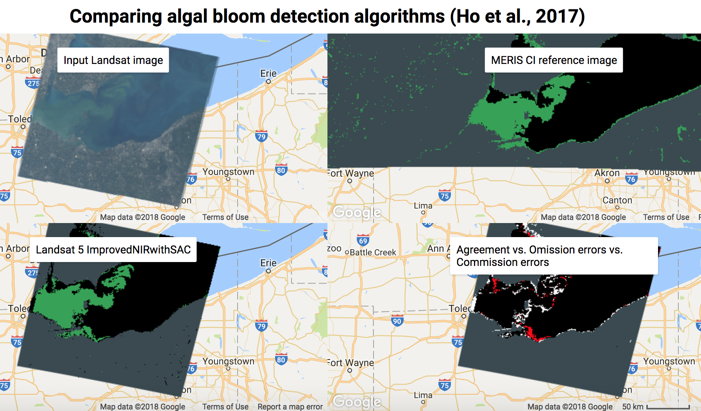
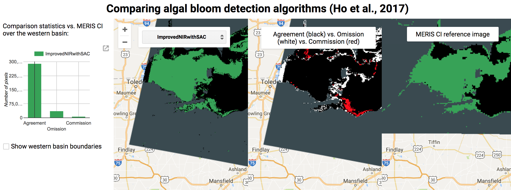

# Scripts cloned from Google Earth Engine code editor

This repository holds my scripts using the GEE Javascript API.

Currently, the only scripts here are those exploring [algal bloom detection over Lake Erie](WaterQuality_LakeErie).

Two scripts in particular, [Bloom Detection Algs](https://github.com/jeffcfho/GEE_CodeEditorScripts/blob/master/WaterQuality_LakeErie/Ho%20et%20al.%20(2017)%20Bloom%20Detection%20Algs.js) and [Select Bloom Detection Algs](https://github.com/jeffcfho/GEE_CodeEditorScripts/blob/master/WaterQuality_LakeErie/Ho%20et%20al.%20(2017)%20Select%20Bloom%20Detection%20Algs.js), compare the different algal bloom detection algorithms we tested in [Ho et al. (2017), "Using Landsat to extend the historical<z record of lacustrine phytoplankton blooms: A Lake Erie case study"](https://www.sciencedirect.com/science/article/pii/S0034425716304928).

To view to their fullest potential, copy the scripts into the [Google Earth Engine code editor](https://code.earthengine.google.com/) and hit Run. The outputs should look something like this:

